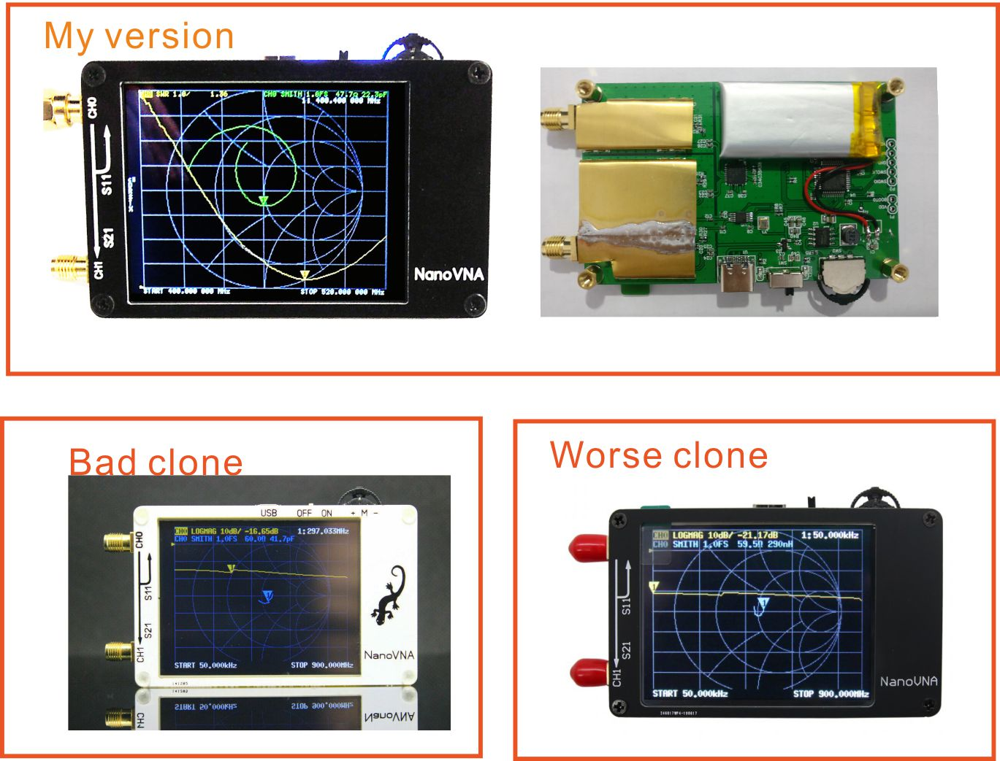

NanoVNA - Very tiny handheld Vector Network Analyzer
==========================================================
DIY的矢量网络分析仪，原项目地址[https://github.com/ttrftech/NanoVNA](https://github.com/ttrftech/NanoVNA),修改了部分电路，增加了电池管理电路，重新设计了PCB。改进了的频率算法，可以利用si5351的奇次谐波扩展支持到900MHz的测量频率，设计了金属屏蔽片，可以减少外部干扰提高测量精度，si5351直接输出的50K-300MHz频段提供优于70dB的动态，扩展的300M-600MHz波段可以提供优于50dB的动态，600M-900M波段优于40dB的动态。
起先我在38hot分享我的修改，但是后来抄板的商家无耻的宣称是他们自己修改了设计，我非常气愤，并一度暂停了相关的分享，现在重新把修改后的代码分享到github，希望这样能够方便参与改进NanoVNA的爱好者，而不是那些粗制滥造的抄板者。
我在gen111.taobao.com出售安装完整的NanoVNA，如果您是海外用户，您可以通过[alibaba](https://www.alibaba.com/product-detail/Original-2-8-Touchscreen-50KHz-900MHz_62232701280.html)购买我制作的硬件。您也可以自己参考[原理图](doc/Schematic_nanovna_Sheet-1_20190711140429.jpg)设计您自己的PCB，需要指出的是模拟电路部分屏蔽与隔离都是重要的，电桥部分是经过严格匹配的，如果你需要使用谐波扩展300M以上测量需要尤为注意。在网络商发现的一些克隆品为了简化安装都错误的进行了修改，这样做是可能导致800M左右的动态小于20dB，失去了测了测量的意义。
另外设计了简单实用的PC控制软件NanoVNASharp，可以通过PC端软件导出Touchstone(snp)文件用于各种无线电设计和仿真软件，NanoVNASharp是一个单独的项目，暂无开源计划。

We remade NanoVNA based on edy555 (https://github.com/ttrftech/NanoVNA) , but  modified some circuits, added battery management circuits, and redesigned the PCB. The improved frequency algorithm can use the odd harmonic extension of si5351 to support the measurement frequency up to 900MHz. The metal shield is designed to reduce the external interference and improve the measurement accuracy. The 50k-300MHz frequency range of the si5351 direct output provides better than 70dB dynamic. The extended 300M-600MHz band provides better than 50dB of dynamics, and the 600M-900M band is better than 40dB of dynamics.
I share my changes on the forum(http://bbs.38hot.net/thread-756047-1-1.html) and provide the original code to users who have purchased my hardware. But a bad clone appeared and claimed to have made improvements by themselves. I was very angry and once suspended the relevant sharing. Now I will share the modified code to github, hoping to participate in the improvement of NanoVNA enthusiasts. Not those bad clones.
I'm selling the full NanoVNA at gen111.taobao.com, if you are an overseas user, you can purchase the hardware I made through [alibaba](https://www.alibaba.com/product-detail/Original-2-8-Touchscreen-50KHz-900MHz_62232701280.html). you can also design your own PCB by [reference schematic](doc/Schematic_nanovna_Sheet-1_20190711140429.jpg), it should be noted that analog circuit partial shielding and isolation are important, the bridge part is strictly matched, if you need to use harmonic extension 300M or more measurements need to pay special attention. Some clones found in the network have been modified incorrectly in order to simplify the installation, which may result in a dynamic of about 800M less than 20dB, which has lost the significance of measuring.
NanoVNASharp is a PC control software can export Touchstone (snp) files which can be used for various radio design and simulation software. NanoVNASharp is a separate project with no open source plans.

How to distinguish between clones.


## 编译
## Build firmware

You can compile with gcc-arm-none-eabi 4 or 5 under linux or macos.
Before compilation you need to copy the chibios directory from the original project of edy555.

  300MHz
```
$ make
```

800MHz
```
$ make FRE=800
```

900MHz
```
$ make FRE=900
```


**注意：代码中有部分包含扩展到1300MHz的内容，那是为新硬件做的尝试，当前硬件不能很好的支持，如果网络上出现扩展到更高频率而未更换混频器或者滤波电路的请不要相信！！！不要再当前硬件使用1300MHz的固件，会导致性能下降！！！**

**Note: Some parts of the code contain content that is extended to 1300MHz. That is an attempt for new hardware. The current hardware cannot support it well. If there is a frequency extension on the network and the mixer or filter circuit is not replaced, please do not believe! ! ! Do not use 1300MHz firmware on the current hardware, which will cause performance degradation! ! !**


以下为原项目自述
==========================================================
The following is the original project readme
==========================================================
# About

NanoVNA is very tiny handheld Vector Network Analyzer (VNA). It is
standalone with lcd display, portable device with battery. This
project aim to provide an RF gadget but useful instrument for
enthusiast.

This repository contains source of NanoVNA firmware.


## Prepare ARM Cross Tools

Install cross tools and firmware updating tool.

    $ brew tap PX4/px4
    $ brew install gcc-arm-none-eabi
    $ brew instal dfu-util

Otherwise, use toolchains included inside LPCxpresso. Like this.

    $ PATH=$PATH:/Applications/lpcxpresso_7.8.0_426/lpcxpresso/tools/bin

## Build firmware

Fetch ChibiOS submodule into tree.

    $ cd nanovna
    $ git submodule update --init --recursive

Just make in the top directory.

    $ make

## Flash firmware

Boot MCU in DFU mode. To do this, jumper BOOT0 pin at powering device.
Then, burn firmware using dfu-util via USB.

    $ dfu-util -d 0483:df11 -a 0 -s 0x08000000:leave -D build/ch.bin


# Control from PC

NanoVNA is able to work standalone, but also be controlled via USB serial interface from PC. There are sample scripts in python directory.

Preparation.

    $ pip install numpy
    $ pip install scikit-rf   

Plot reflection LOGMAG.

    $ cd python
    $ ./nanovna.py -p

Plot transmission LOGMAG.

    $ ./nanovna.py -p -P 1

Plot smithchart.

    $ ./nanovna.py -s

Show usage.

    $ ./nanovna.py -h

To use NanoVNA from Jupyter notebook, see [this page](https://github.com/ttrftech/NanoVNA/blob/master/python/NanoVNA-example.ipynb).

## Reference

* [Schematics](https://github.com/ttrftech/NanoVNA/blob/master/doc/nanovna-sch.pdf)
* [PCB Photo](https://github.com/ttrftech/NanoVNA/blob/master/doc/nanovna-pcb-photo.jpg)
* [Block Diagram](https://github.com/ttrftech/NanoVNA/blob/master/doc/nanovna-blockdiagram.png)
* Kit available from http://ttrftech.tumblr.com/kit/nanovna
* Credit: @edy555

[EOF]
